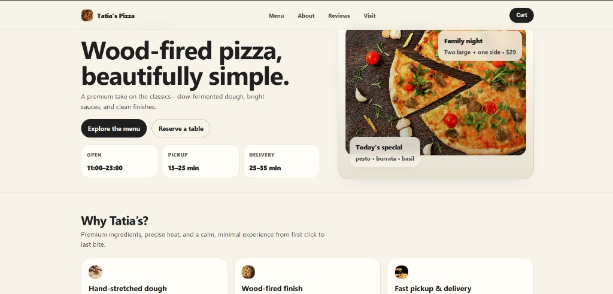
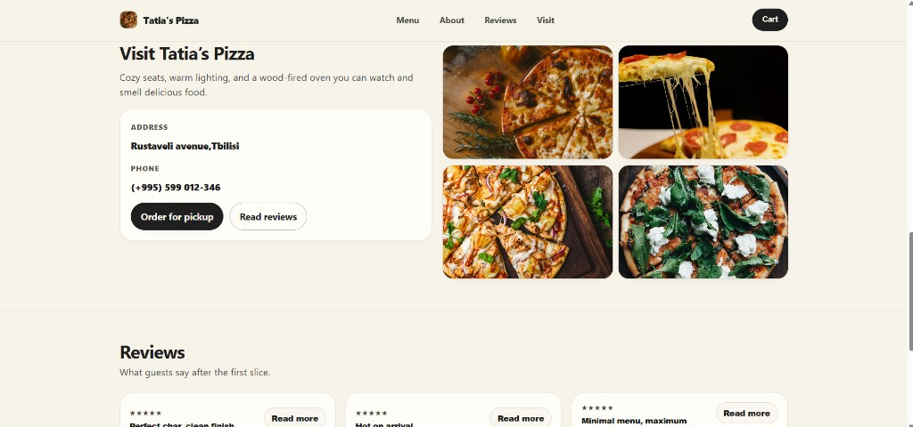

# Tatia’s Pizzeria

Modern, premium pizzeria landing page built with **Vite + Preact**. Includes a functional cart drawer and a clean component-based structure.

## Screenshots

>   `docs/screenshots/` 
> - `docs/screenshots/home.png`
> - `docs/screenshots/sections.png`




## Features

- **Landing page**: hero, features, menu, gallery, reviews, visit, footer
- **Cart drawer**: add items, change quantities, remove, clear, total price
- **UI polish**: smooth scrolling, interactive gallery lightbox, interactive reviews
- **Clean structure**: constants, hooks, components, utilities separated

## Tech stack

- **Vite**
- **Preact** (React-like API)
- **CSS** (no UI framework)

## Getting started

Install dependencies:

```bash
npm install
```

Start the dev server:

```bash
npm run dev
```

Build for production:

```bash
npm run build
```

Preview the production build:

```bash
npm run preview
```

## Project structure

- `src/app.jsx`: app composition (wires constants + components + cart)
- `src/components/`: UI sections (`Header`, `Hero`, `MenuSection`, etc.)
- `src/hooks/`: reusable hooks (`useCart`)
- `src/cart/`: cart UI (`CartPanel`) + cart styles
- `src/constants/`: app data (`menu`, `features`, `gallery`, `brand`)
- `src/utils/`: shared utilities (e.g. `fallbackIcon`)
- `public/`: static files (favicons, etc.)

